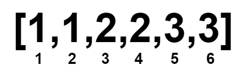

# 2856. Minimum Array Length After Pair Removals

Given an integer array num sorted in non-decreasing order.

You can perform the following operation any number of times:

Choose two indices, i and j, where nums[i] < nums[j].
Then, remove the elements at indices i and j from nums. The remaining elements retain their original order, and the array is re-indexed.
Return the minimum length of nums after applying the operation zero or more times.

 

Example 1:
```c
Input: nums = [1,2,3,4]

Output: 0

```
Explanation:


Example 2:
```c
Input: nums = [1,1,2,2,3,3]

Output: 0
```
Explanation:



Example 3:

Input: nums = [1000000000,1000000000]

Output: 2

Explanation:

Since both numbers are equal, they cannot be removed.

Example 4:

Input: nums = [2,3,4,4,4]

Output: 1

Explanation:


 

Constraints:
```
1 <= nums.length <= 105
1 <= nums[i] <= 109
nums is sorted in non-decreasing order.
```